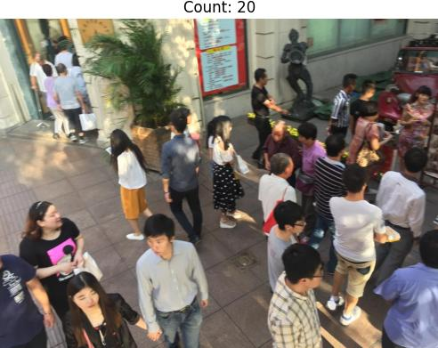
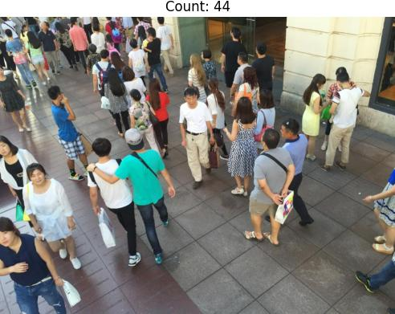
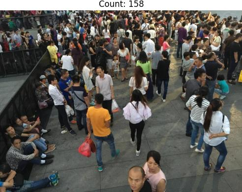

# Crowd-Counting-Pytorch

## Overview
This repository is built for educational purposes on CSRNet in crowd counting, a frequent practice by others over the past half-decade. Crowd counting is a crucial task in computer vision, aimed at estimating the number of individuals in an image or video. It leverages the power of convolutional neural networks with dilated convolutions to capture contextual information effectively. Despite its popularity, CSRNet has limitations that affect its reliability in accurately predicting crowd sizes. Alternative methods include predicting bounding boxes or positions of people in large crowds, which often results in robust performance albeit with additional data annotations.

This repository attempt's attempt at novelty includes the Inception module, originally from googlenet, since the module extracts and aggregates features with different kernel sizes, resulting in combined multi-scale features. The additional module between the backend and final convolution did not yield significant performance change, though the model has not been extensively tested.

This repository includes:
- CSRNet Model Implementation: A PyTorch implementation of the modified CSRNet model.
- Image Inference Script: A script to perform inference on a folder of images, generating crowd density heatmaps and overlaying them on the original images.
- Video Inference Script: A script to perform inference on a video file, generating crowd density heatmaps for each frame and overlaying them on the original frames.

## Usage
- For image inference, run the following code snippet.

```python
python img_inference.py --input_dir path/to/image_folder --output_dir path/to/output_folder --model_pth path/to/model_pth
```

- For video inference, run the following code snippet.

```python
python video_inference.py --input path/to/video.mp4 --output path/to/output.mp4 --model_pth path/to/model_pth
```

# Model Weights
The pre-trained model weights for CSRNet can be downloaded directly from this repository. Make sure to specify the correct path when running inference.

# Visual Results
<div align="center">
  
  <p><em>Figure 1: IMG 44 from Shanghai Tech Test dataset Part A</em></p>
</div>
<div align="center">
  
  <p><em>Figure 2: IMG 59 from Shanghai Tech Test dataset Part A</em></p>
</div>
<div align="center">
  
  <p><em>Figure 3: IMG 98 from Shanghai Tech Test dataset Part A</em></p>
</div>